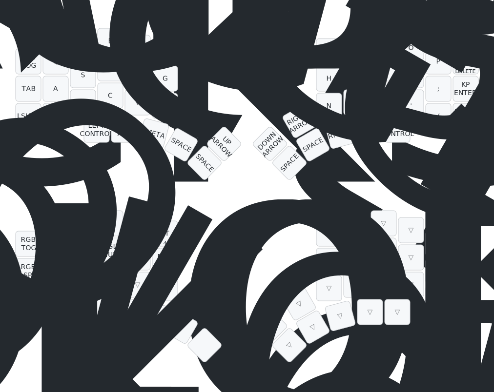

# ZMK Keeps conig

This is my [ZMK](https://zmk.dev) configuration for my 
- [Aurora Corne](https://splitkb.com/products/aurora-corne)
- [SplitKB Kyria](https://splitkb.com/collections/keyboard-kits/products/kyria-rev2-pcb-kit)

## Training Sites

- https://www.keybr.com/
- https://monkeytype.com/

## Flashing

- Update the `./config/{*.conf,*.keymap}` files as needed.
- Navigate to the [Actions](https://github.com/stiliajohny/ZMK-keebs-configs/actions/workflows/firmware-build.yaml)
  - Download the latest artifact called `firmware.bin` from the latest Github Action
- Unzip and transfer the relevant firmware to the keyboard ( note there are left/right firmwares to be flashed) 
  
> Good tool to edit the keymap: is [keymap-editor](https://nickcoutsos.github.io/keymap-editor/)

## My Keymap

### Aurora Corne

here

### Kyria

here

