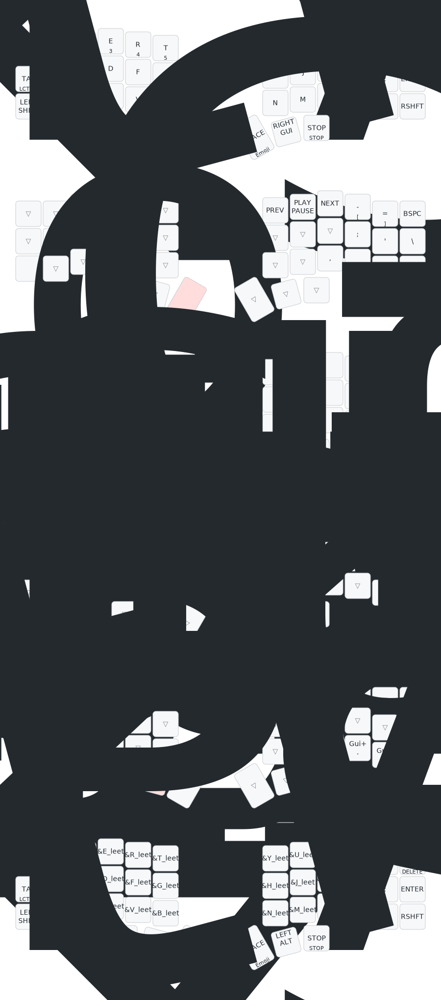

# zmk config-aurora-corne-1.0-nice-nano

This is my [ZMK](https://zmk.dev) configuration for my [Aurora Corne](https://splitkb.com/products/aurora-corne)

## Flashing

Update the `./config/{*.conf,*.keymap}` files as needed.

> Good tool to edit the keymap: is [keymap-editor](https://nickcoutsos.github.io/keymap-editor/)

## My Keymap

